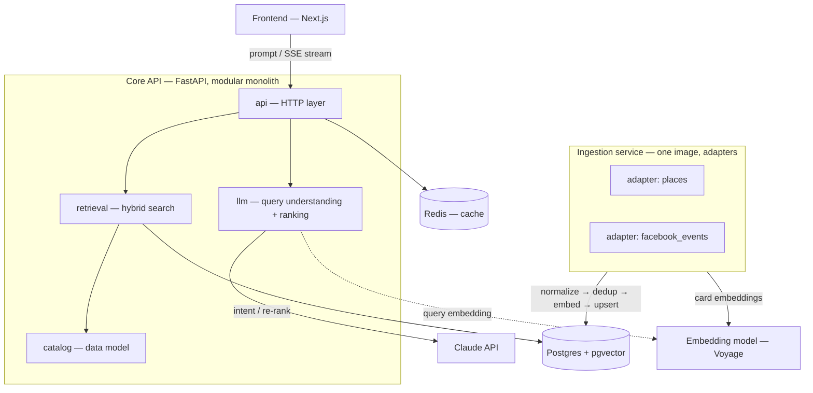

# Architecture

## Approach

The backend is a **modular monolith + an ingestion pipeline**. The core (the
API) is a single deployment with clear internal modules; data collection from
external sources is a separate process with one adapter per source, run on a
schedule by k8s CronJobs. We deliberately do **not** run a microservice per
source — that would be extra deploys and CI with no benefit at our scale. No
Kafka either: ingestion writes to Postgres directly; if background queues are
ever needed, Redis + Celery is enough.

## Diagram

- **Top half — the user request path:** the frontend sends a prompt to the Core
  API; inside, the `llm` module calls Claude (parse the prompt, then rank), the
  `retrieval` module finds candidates in Postgres, and the answer streams back.
- **Bottom half — filling the catalog:** the ingestion service pulls data from
  sources on a schedule and stores it in the same Postgres. It is not in the
  request path.

## Core API modules

| Module | Responsibility |
|---|---|
| `api` | HTTP endpoints, SSE streaming, request validation |
| `llm` | Claude calls: prompt → intent, candidate re-rank, card blurbs, embeddings |
| `retrieval` | Hybrid search: SQL filters + pgvector vector search |
| `catalog` | Data model, DB access |

## Database — Postgres + pgvector

**One database for everything.** Structured data (opening hours, prices, dates)
and vector embeddings live in the same table, so semantic search and filters
run in a single SQL query. A separate vector DB (Qdrant, etc.) is unnecessary:
Warsaw has thousands of cards, not millions, and two stores would need constant
syncing. The embedding column uses an HNSW index with `vector_cosine_ops`.

## Ingestion service

One Docker image with a shared pipeline (`fetch → normalize → dedup → embed →
upsert`) and one adapter class per source. Run as k8s **CronJobs**: one CronJob
per source, the same image, only the `--source` argument changes. A new source =
a new adapter class (~50–100 lines) + a line in the registry + a CronJob
manifest. See [ingestion.md](ingestion.md).

## Frontend

Next.js + Tailwind. The browser POSTs the prompt and reads the SSE response,
rising cards into a Booking-style grid as they are ranked. Design follows the
**Pure** dating-app aesthetic: stark monochrome, heavy type, one accent color,
photo-forward cards.

## Scaling and future work

The Core API is stateless — scale with replicas + HPA. Postgres scales
vertically first, then read replicas. The real cost driver at scale is LLM
calls; levers are the Redis cache, prompt caching, and the top-N size. A future
account module (`auth` + `users` / `favorites` / `search_history` tables, JWT in
an httpOnly cookie, Google OAuth) fits the same Postgres without schema churn;
search without sign-in stays, with `user_id` optional.
